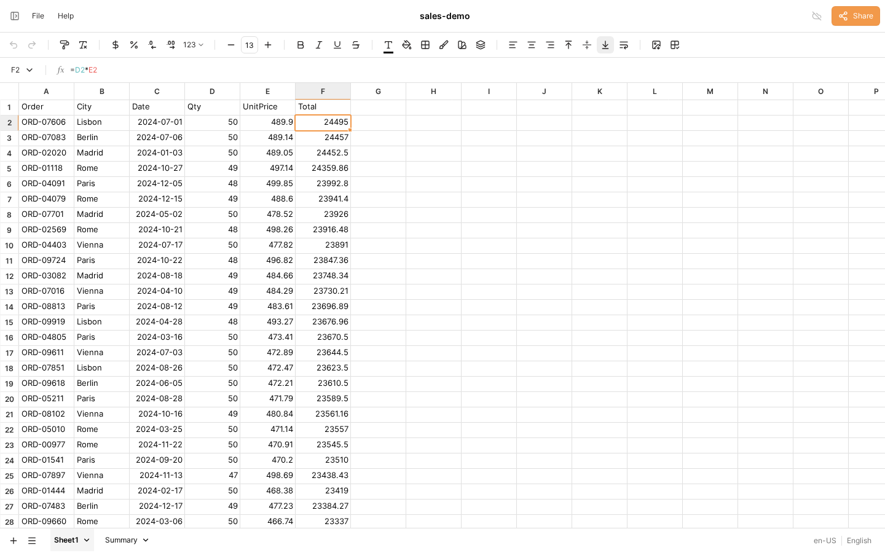
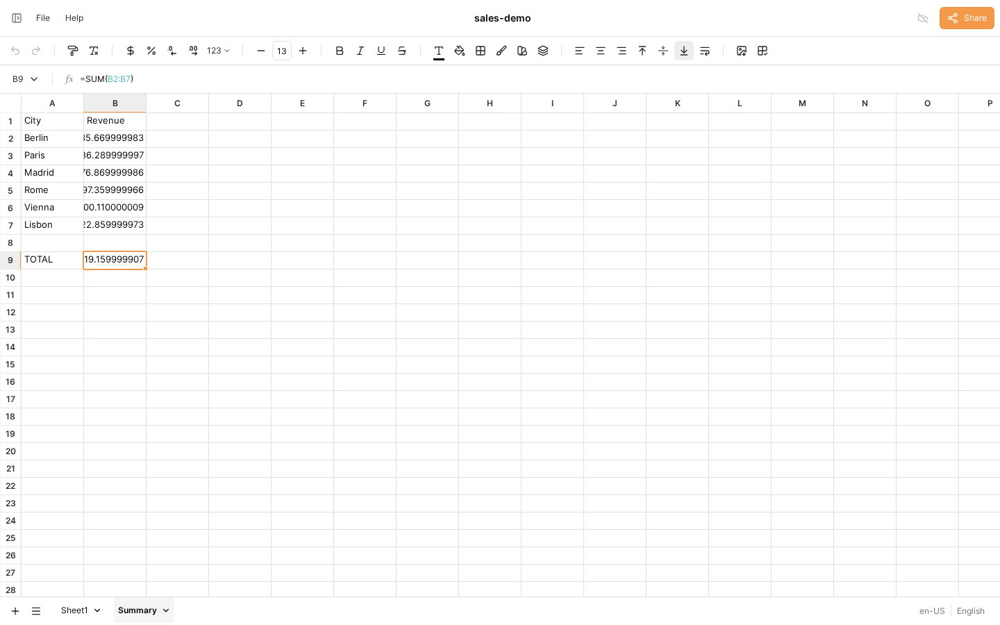

# Showcase: an MCP session, rendered in IronCalc's own app

The workbook below was produced entirely through `sheetd mcp` — a real MCP
stdio session (initialize → tools/list → tools/call), no library shortcuts —
then opened in the stock IronCalc web app via its regular xlsx import.

The task: a 10,000-row CSV of orders → add a computed `Total` column, verify
it, sort by it, and build a per-city revenue summary sheet with a checked
grand total. Six tool calls end to end.

## The session (abridged)

```text
>>> tools/call sheet_open {"path": "orders10k.csv"}
opened wb1 from orders10k.csv

workbook "orders10k" — 1 sheet
Sheet1: used A1:E10001
  table1 (Sheet1!A1:E10001, 10000 rows + header)
    A "Order"      text · sorted asc
    B "City"       text, 6 distinct · values: "Vienna"×1754, "Rome"×1675, …
    C "Date"       date 2024-01-01..2024-12-28
    D "Qty"        number 1..50
    E "UnitPrice"  number 1.09..499.98

>>> tools/call sheet_exec {script: "checkpoint start / set F1 Total /
    set F2 =D2*E2 / fill F2 -> F2:F10001 / expect F2 == 1053.78 /
    sort table1 by Total desc / expect F2 >= 20000"}
checkpoint "start" saved
filled F2:F10001 from F2
expect F2 == 1053.78: OK (actual 1053.78)
sorted A1:F10001 rows 2..10001 by F desc
expect F2 >= 20000: OK (actual 24495)
recalc: 58171 cells changed
  A2 "ORD-00001" ⇒ "ORD-07606" · …
⚠ 10000 formula cells moved and re-anchored to their new rows

>>> tools/call sheet_exec {script: "sheet new Summary / … /
    set B2:B7 =SUMIF(Sheet1!B:B, A2, Sheet1!F:F) / set B9 =SUM(B2:B7) /
    expect B9 > 0 / highlight B9 color=green note=…"}
expect B9 > 0: OK (actual 63032119.16)
highlight #1 on Summary!B9 (green)

>>> tools/call sheet_view {target: "Summary!A1:B9"}
Summary!A1:B9 [region: table2]
  | A"City"   B"Revenue"
2 | "Berlin"  =SUMIF(Sheet1!B:B,A2,Shee… ⇒ 10462235.67
…
9 | "TOTAL"   =SUM(B2:B7) ⇒ 63032119.16

>>> tools/call sheet_save {path: "sales-demo.xlsx"}
>>> tools/call sheet_close
```

## The result in the IronCalc app

Sheet1, sorted by the agent's computed column — `F2` selected, the formula
bar shows the re-anchored `=D2*E2`:



The Summary sheet the agent created — `B9` selected, `=SUM(B2:B7)` in the
formula bar:


